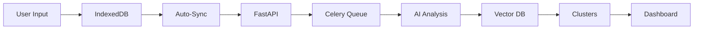

# SIGMENT - AI Smart Notes for Strategic Decision Making

<div align="center">


**"Fire & Forget"** Idea Capture → Context-Aware AI Analysis → Strategic Decision Dashboard

[](https://nextjs.org/)
[](https://fastapi.tiangolo.com/)
[](https://www.python.org/)
[](https://www.typescriptlang.org/)
[](https://openai.com/)
[](https://supabase.com/)

</div>

---

## 🎯 Concept Core

SIGMENT transforme la capture d'idées en entreprise B2B en un système stratégique intelligent :

1. **Employés** : Saisissent leurs idées sans friction ("Fire & Forget")
2. **IA** : Analyse, classifie et regroupe intelligemment les idées
3. **Board/Direction** : Visualise les tendances stratégiques avec contexte

### 🔥 Problème Résolu

- ❌ Les bonnes idées se perdent dans les emails et réunions
- ❌ Pas de système pour capturer les insights terrain
- ❌ La direction manque de visibilité sur les préoccupations réelles
- ❌ Les formulaires complexes découragent la participation

### ✅ Solution SIGMENT

- ✨ **Capture Ultra-Simple** : Un champ texte, un bouton. C'est tout.
- 🤖 **IA Contextuelle** : Prend en compte qui dit quoi (département, séniorité)
- 📊 **Clustering Intelligent** : Regroupe automatiquement les idées similaires
- ⏳ **Time-Lapse** : Visualise l'évolution des clusters dans le temps
- 🎯 **Scoring Pondéré** : Les idées sont notées selon l'expertise de l'auteur

---

## 🏗️ Architecture Technique

### Stack Technologique

| Couche | Technologie | Rôle |
|--------|-------------|------|
| **Frontend** | Next.js 14 (App Router) + TypeScript | Interface utilisateur moderne |
| **State Management** | TanStack Query + Dexie.js | Offline-first, auto-sync |
| **Backend API** | Python FastAPI | REST API performante |
| **Async Processing** | Celery + Redis | Traitement AI en arrière-plan |
| **Database** | PostgreSQL (Supabase) + pgvector | Base de données vectorielle |
| **AI Provider** | OpenAI (GPT-4o + embeddings) | Analyse et vectorisation |

### Flux de Données



---

## ✨ Fonctionnalités Clés

### 1. 🚀 Fire & Forget Input

- Interface minimaliste et sans distraction
- Sauvegarde instantanée (< 100ms)
- Fonctionne **offline** (IndexedDB)
- Auto-sync en arrière-plan
- Feedback immédiat (toast notification)

### 2. 🧠 AI Context-Aware Analysis

Chaque note est analysée avec le contexte de l'auteur :

```python
# Exemple de scoring contextuel
HR Manager parle de Recrutement → Score: 9/10 (expertise)
Développeur parle de Recrutement → Score: 4/10 (hors expertise)
```

**Pipeline AI complet** :
1. **Clarification** : Réécriture pour les dirigeants
2. **Classification** : Attribution au bon "Pillar" stratégique
3. **Scoring** : Note de pertinence (1-10) basée sur l'expertise
4. **Vectorisation** : Génération d'embedding (1536 dimensions)
5. **Clustering** : Regroupement avec idées similaires (>75% similarité)
6. **Synthèse** : Résumé exécutif pour chaque cluster

### 3. 📊 Strategic Pillars

Catégories stratégiques prédéfinies par l'entreprise :

- 🌱 **ESG** : Initiatives environnementales et sociales
- 💡 **Innovation** : Idées produit et R&D
- ⚙️ **Operations** : Efficacité opérationnelle
- 💝 **Customer Experience** : Satisfaction client
- 👥 **Culture & HR** : Expérience employé

### 4. 🌌 Galaxy Dashboard (Prévu)

Visualisation des clusters comme une "galaxie d'idées" :

- Taille des bulles = nombre d'idées
- Couleur = pillar stratégique
- Position = similarité thématique
- Clic = détail du cluster + time-lapse

### 5. ⏳ Time-Lapse Feature

Chaque cluster conserve son historique :

```
Janvier : "3 notes sur l'onboarding"
Mars : "12 notes → Synthèse enrichie"
Juin : "25 notes → Trend confirmé"
```

Un slider permet de "voyager dans le temps" et voir l'évolution.

### 6. 📈 Contextual Weighting

Les idées sont pondérées selon :
- **Expertise** : Le sujet correspond-il au domaine de l'auteur ?
- **Séniorité** : Niveau hiérarchique (1-5)
- **Volume** : Combien de personnes mentionnent ce sujet ?

---

## 🚀 Quick Start

### Prérequis

- Node.js 18+
- Python 3.10+
- Docker (pour Redis)
- Compte Supabase (gratuit)
- Clé API OpenAI

### Installation (5 minutes)

```bash
# 1. Cloner le projet
git clone <repo-url>
cd sigment

# 2. Configurer .env (voir QUICKSTART.md)
cp .env.example .env
# Remplir avec vos clés Supabase + OpenAI

# 3. Appliquer le schéma SQL à Supabase
# Copier database/schema.sql dans Supabase SQL Editor

# 4. Backend
cd backend
python -m venv venv
source venv/bin/activate
pip install -r requirements.txt

# 5. Frontend
cd ../frontend
npm install

# 6. Démarrer les services
docker-compose up -d                    # Redis
cd backend && uvicorn main:app --reload # Terminal 1
cd backend && celery -A app.workers.celery_app worker --loglevel=info  # Terminal 2
cd frontend && npm run dev              # Terminal 3
```

**Accès** : http://localhost:3000

📚 **Documentation complète** : Voir `QUICKSTART.md` et `SETUP.md`

---

## 📖 Documentation

| Document | Description |
|----------|-------------|
| [QUICKSTART.md](./QUICKSTART.md) | ⚡ Guide de démarrage rapide (5-10 min) |
| [SETUP.md](./SETUP.md) | 📚 Instructions d'installation détaillées |
| [ARCHITECTURE.md](./ARCHITECTURE.md) | 🏗️ Architecture système et flux de données |
| [PROJECT_STRUCTURE.md](./PROJECT_STRUCTURE.md) | 📁 Structure des dossiers et fichiers |

---

## 🎨 UX Philosophy

### Fire & Forget Principle

**Objectif** : Zéro friction. L'utilisateur ne doit pas réfléchir.

```
1. Ouvrir l'app
2. Taper son idée
3. Cliquer "Send"
4. ✅ C'est fini. L'écran se vide.
```

**Pas de** :
- ❌ Catégories à choisir
- ❌ Formulaires complexes
- ❌ Attente de traitement
- ❌ Confirmation multiple

**L'IA s'occupe de tout en arrière-plan.**

---

## 🔐 Sécurité & Privacy

### Implémentation Actuelle (MVP)

- ✅ Variables d'environnement sécurisées
- ✅ Service role key côté backend uniquement
- ✅ Validation des inputs (Pydantic)
- ⚠️ Pas d'authentification (à implémenter)

### Production Roadmap

- [ ] Supabase Auth (OAuth + Magic Link)
- [ ] Row-Level Security (RLS) sur PostgreSQL
- [ ] Rate limiting sur l'API
- [ ] Audit logs pour modération
- [ ] GDPR compliance (export/delete data)

---

## 📊 Base de Données

### Schéma Principal

```sql
users            → Contexte (job, département, séniorité)
pillars          → Catégories stratégiques
notes            → Idées individuelles + embeddings vectoriels
clusters         → Groupes d'idées similaires
cluster_snapshots → Historique pour time-lapse
```

### Vector Search (pgvector)

```sql
-- Recherche de notes similaires
SELECT id, 1 - (embedding <=> query_embedding) as similarity
FROM notes
WHERE pillar_id = 'xxx'
ORDER BY embedding <=> query_embedding
LIMIT 10;
```

---

## 🧪 Tests

### Backend

```bash
cd backend
pytest tests/
```

### Frontend

```bash
cd frontend
npm test
```

---

## 🚀 Déploiement Production

### Recommandations

| Service | Plateforme | Notes |
|---------|-----------|-------|
| Frontend | **Vercel** | Optimisé pour Next.js, CI/CD intégré |
| Backend API | **Render.com** | Web Service (FastAPI) |
| Celery Worker | **Render.com** | Background Worker |
| Redis | **Upstash** | Redis managé, pricing généreux |
| Database | **Supabase** | Déjà hébergé, pgvector supporté |

### Variables d'Environnement

Toutes les variables dans `.env` doivent être configurées sur chaque plateforme.

---

## 🗺️ Roadmap

### Phase 1 - MVP ✅ (Complété)

- [x] Fire & Forget input
- [x] Offline-first avec Dexie.js
- [x] AI analysis pipeline
- [x] Vector clustering
- [x] Tracker page
- [x] Context-aware scoring

### Phase 2 - Dashboard 🚧 (En cours)

- [ ] Galaxy visualization (D3.js)
- [ ] Time-lapse slider
- [ ] Admin moderation panel
- [ ] Pillar filters
- [ ] Search & filters

### Phase 3 - Advanced Features 📅 (Planifié)

- [ ] Real-time updates (WebSocket)
- [ ] Email digests
- [ ] Export to PDF
- [ ] Sentiment analysis
- [ ] Trend detection
- [ ] Mobile app (React Native)

### Phase 4 - Integrations 🔮 (Futur)

- [ ] Slack integration
- [ ] Microsoft Teams
- [ ] Email parsing
- [ ] Calendar integration
- [ ] Jira/Linear sync

---

## 🤝 Contribution

Ce projet est actuellement en développement interne.

Pour contribuer :
1. Fork le projet
2. Créer une branche feature (`git checkout -b feature/AmazingFeature`)
3. Commit vos changements (`git commit -m 'Add AmazingFeature'`)
4. Push la branche (`git push origin feature/AmazingFeature`)
5. Ouvrir une Pull Request

---

## 📜 License

Propriétaire - Tous droits réservés © 2025 SIGMENT

---

## 🙏 Remerciements

Technologies utilisées :
- [Next.js](https://nextjs.org/)
- [FastAPI](https://fastapi.tiangolo.com/)
- [OpenAI](https://openai.com/)
- [Supabase](https://supabase.com/)
- [Celery](https://docs.celeryq.dev/)
- [Dexie.js](https://dexie.org/)

---

## 📞 Support

Pour toute question ou problème :

1. 📖 Consultez la documentation (`QUICKSTART.md`, `SETUP.md`)
2. 🐛 Vérifiez les logs (backend, Celery, browser console)
3. 💬 Ouvrez une issue sur le repository

---

<div align="center">

**Fait avec ❤️ pour transformer la capture d'idées en entreprise**

[Documentation](./QUICKSTART.md) • [Architecture](./ARCHITECTURE.md) • [Setup](./SETUP.md)

</div>
